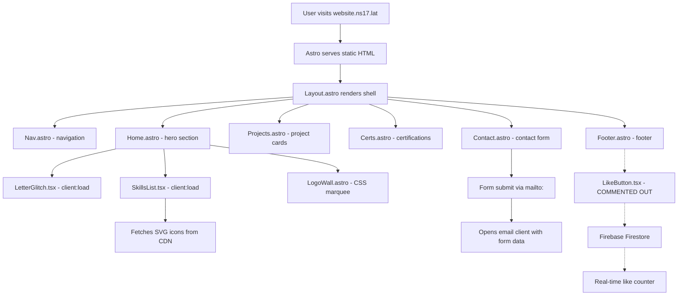

# 🧠 x-undisclosed — Project Mindmap

> **Dark Portfolio** — A sleek, dark-themed personal portfolio for **Vedansh** ([@offensive-vk](https://github.com/offensive-vk))  
> Live at **[website.ns17.lat](https://website.ns17.lat)** · Built with Astro + React + Tailwind CSS  

---

## 📐 Architecture Overview

```
┌────────────────────────────────────────────────────────────┐
│                     ASTRO (Static SSG)                     │
│  ┌──────────┐  ┌────────────┐  ┌────────────────────────┐ │
│  │  Layout   │  │   Pages    │  │      Components        │ │
│  │ (Shell)   │──│ index.astro│──│ Nav, Home, Projects,   │ │
│  │ HTML/SEO  │  │  (Single   │  │ Certs, Contact, Footer │ │
│  │ Meta tags │  │   Page)    │  │ LogoWall               │ │
│  └──────────┘  └────────────┘  └────────────────────────┘ │
│                                                            │
│  ┌─────────────── React Islands (client:load) ──────────┐ │
│  │  LetterGlitch.tsx   SkillsList.tsx   LikeButton.tsx   │ │
│  │  (Canvas glitch)    (Accordion)      (Firebase likes) │ │
│  └───────────────────────────────────────────────────────┘ │
│                                                            │
│  ┌──────────────────── Integrations ────────────────────┐ │
│  │  @astrojs/tailwind   @astrojs/react   Firebase SDK   │ │
│  └──────────────────────────────────────────────────────┘ │
└────────────────────────────────────────────────────────────┘
         │                    │                    │
    Cloudflare Pages     Docker Container    GitHub Actions
    (Production)         (Dev/Staging)       (CI/CD)
```

---

## 📁 File Structure

```
x-undisclosed/
├── .github/
│   ├── FUNDING.yml              # GitHub Sponsors (offensive-vk)
│   └── workflows/
│       ├── ci.yml               # Build matrix: 3 OSes × 3 Node versions
│       ├── docker.yml           # Docker image build test
│       └── mirror.yml           # Repo sync to mirror target
│
├── public/
│   ├── .well-known/
│   │   └── security.txt         # RFC 9116 security disclosure [NEW]
│   ├── _headers                 # Cloudflare Pages security headers [NEW]
│   ├── favicon.png              # Site favicon (75KB PNG)
│   ├── logo-black.svg           # Black logo variant (shortcut icon)
│   ├── logo-color.svg           # Color logo variant (OG image + favicon)
│   ├── home.svg                 # Home icon asset
│   ├── contact.svg              # Contact icon asset
│   ├── llms.txt                 # LLM-readable site description [NEW]
│   ├── robots.txt               # SEO crawlers + AI bot blocking [UPDATED]
│   ├── sitemap.xml              # Single-page sitemap
│   ├── fonts/
│   │   ├── Carattere.ttf        # Decorative font
│   │   ├── Kaisei Decol.ttf     # Japanese-inspired font (4.2MB)
│   │   └── SF-Pro-Display-Regular.otf  # Apple system font (2.2MB)
│   ├── icons/                   # Reserved for future icon assets
│   └── media/
│       ├── old-icon.png         # Legacy icon
│       └── spotted.jpg          # Image asset
│
├── src/
│   ├── env.d.ts                 # Astro type reference
│   ├── firebase.ts              # Firebase app init + Firestore export
│   │
│   ├── layouts/
│   │   └── Layout.astro         # Root HTML shell (head, meta, fonts, styles)
│   │
│   ├── pages/
│   │   └── index.astro          # Single page assembling all sections
│   │
│   ├── components/
│   │   ├── Nav.astro            # Fixed nav bar (top on desktop, bottom on mobile)
│   │   ├── Home.astro           # Hero section with title, social links, skills, glitch
│   │   ├── LogoWall.astro       # Infinite scrolling tech logo marquee
│   │   ├── Projects.astro       # Project cards grid (4 projects)
│   │   ├── Certs.astro          # Certifications grid (4 Cisco certs)
│   │   ├── Contact.astro        # Contact form with mailto: submit
│   │   └── Footer.astro         # Social links, tech stack badges, copyright
│   │
│   ├── lib/
│   │   ├── LetterGlitch.tsx     # React: Canvas-based matrix glitch animation
│   │   ├── SkillsList.tsx       # React: Accordion with remote SVG icons
│   │   └── LikeButton.tsx       # React: Firebase-powered like counter
│   │
│   └── styles/
│       └── global.css           # Tailwind CSS entry point
│
├── .env.example                 # Environment variable template [NEW]
├── astro.config.mjs             # Astro config: static output, port 7777, aliases
├── tailwind.config.mjs          # TW config: custom scale animation keyframes
├── tsconfig.json                # TS: nodenext, react-jsx, path aliases
├── package.json                 # v1.1.1, pnpm, Astro 6.4.4
├── pnpm-workspace.yaml          # Build allows + dependency overrides
├── pnpm-lock.yaml               # Lockfile (280KB)
├── Dockerfile                   # Node 26-slim, pnpm, build + preview serve
├── .dockerignore                # Excludes node_modules, dist, .astro
├── .gitignore                   # Standard Astro ignores
├── .env                         # SYSVER=1, CI=true (no secrets)
├── .mailmap                     # Git author mapping: Vedansh
├── root.ns17-lat.html           # Standalone splash page (ns17-assets reference)
├── CODE_OF_CONDUCT.md           # Contributor Covenant
├── LICENSE                      # MIT License
└── README.md                    # Setup + Docker instructions
```

---

## 🔄 Data Flow



---

## 🧩 Component Deep Dive

### 1. Layout.astro (Root Shell)
- **SEO**: Full OG meta, canonical URL, robots, keywords
- **Fonts**: Montserrat (preloaded), Merriweather, Kaisei Decol, Carattere
- **CSS Variables**: `--background`, `--sec`, `--white`, `--white-icon`, `--white-icon-tr`, `--container`, `--pink`, `--line`
- **Global Styles**: Custom scrollbar (webkit + Firefox), text selection color, universal reset

### 2. Nav.astro (Navigation)
- **4 nav items**: Home, Projects, Contact, Certifications
- **Responsive**: Top pill on desktop (`md:top-0`), bottom bar on mobile (`bottom-0`)
- **Smooth scroll**: JS click handler with `scrollIntoView`
- **Active section**: IntersectionObserver highlights current section
- **Icons**: Inline SVG per nav item, shown on mobile, hidden on desktop (text labels instead)

### 3. Home.astro (Hero)
- **Title**: "Information Security Engineer" with animated gradient text
- **Social links**: GitHub, LinkedIn, Email (Gmail compose)
- **Sub-components**:
  - `LogoWall` — scrolling tech marquee (12 techs × 3 for seamless loop)
  - `SkillsList` — interactive accordion (React island)
  - `LetterGlitch` — matrix-style canvas animation (React island)
- **Shiny text effect**: CSS gradient background-clip animation

### 4. LogoWall.astro (Tech Marquee)
- **12 technologies**: linux, cplusplus, typescript, docker, tailwindcss, nodejs, python, bash, javascript, git, github, cloudflare
- **Infinite scroll**: CSS `@keyframes scroll` with `translateX(-50%)`
- **Edge fade**: Gradient overlays on left and right edges
- **Icons from CDN**: `cdn.jsdelivr.net/gh/offensive-vk/Icons@master/`

### 5. Projects.astro (Portfolio)
- **4 projects**: Quizzly, R2 Client, Temp, GitHub User Activity
- **Cards**: Title + status + code icon + conditional preview arrow
- **CTA**: "Browse Other Projects" → GitHub repositories
- **Image support**: Interface defined but commented out (`Image` from `astro:assets`)

### 6. Certs.astro (Certifications)
- **4 Cisco certs**: OS Support, Network Security, Ethical Hacker, Linux Essentials
- **Cards**: Glowing hover shadow (`box-shadow` with `--sec` color)
- **Links**: Credly badge URLs

### 7. Contact.astro (Contact Form)
- **Fields**: Name, Email, Message (textarea)
- **Submit handler**: Composes `mailto:` link with form data
- **Success state**: Hides form, shows "✅ Thank you" message

### 8. Footer.astro
- **Social links**: GitHub, Email (same as hero)
- **Tech badges**: Astro, TailwindCSS, Cloudflare with hover color reveal
- **Copyright**: 2026 with GitHub link
- **LikeButton**: Commented out (`<!-- <LikeButton client:load /> -->`)

### 9. LetterGlitch.tsx (React Island)
- **Canvas-based**: Random chars from A-Z, 0-9, symbols
- **Color interpolation**: Smooth hex-to-RGB transitions
- **Configurable**: `glitchColors`, `glitchSpeed`, `centerVignette`, `outerVignette`, `smooth`
- **Resize-aware**: Debounced resize handler recalculates grid
- **Performance**: `requestAnimationFrame` loop, updates 5% of chars per frame

### 10. SkillsList.tsx (React Island)
- **3 categories**: System Administration, GitHub Actions, Containerization
- **Remote icons**: Fetches SVG from CDN, renders with `dangerouslySetInnerHTML`
- **Accordion**: Single-open toggle pattern
- **Loading/Error states**: Shows "Loading icons..." or error fallback

### 11. LikeButton.tsx (React Island — Unused)
- **Firebase integration**: Reads/writes `likes/counter` document
- **Real-time**: `onSnapshot` listener for live updates
- **Local state**: `localStorage` tracks if user already liked
- **Animations**: Scale animation on click/update

---

## 🏗️ Infrastructure & DevOps

### CI/CD (GitHub Actions)
| Workflow | Trigger | Purpose |
|----------|---------|---------|
| `ci.yml` | push/PR to `master` | Build matrix: 3 OS × 3 Node versions (24, 25, 26) |
| `docker.yml` | push/PR to any branch | Build Docker image test |
| `mirror.yml` | push to any branch | Sync repo to mirror via `auto-repo-sync` |

### Docker
- **Base**: `node:26-slim`
- **Build**: `pnpm install` → `pnpm run build`
- **Serve**: `pnpm run preview` (serves built dist/)
- **Port**: 7777

### Deployment
- **Platform**: Cloudflare Pages
- **Domain**: website.ns17.lat
- **Output**: Static (`output: 'static'` in Astro config)

---

## 🐛 Issues & Bugs — Resolution Status

### 🔴 Critical — All Fixed ✅

1. ~~**Contact form `action` is empty**~~ → ✅ Replaced broken `fetch(form.action)` with working `mailto:` approach
2. ~~**LinkedIn link is generic**~~ → ⚠️ `rel="noopener noreferrer"` added. URL update left to owner
3. ~~**`@types/react` version conflict**~~ → ✅ Removed from `dependencies`, normalized to `^19.0.10` in `devDependencies`

### 🟡 Moderate — All Fixed ✅

4. ~~**Dockerfile runs dev server**~~ → ✅ Changed `CMD` to `pnpm run preview`
5. ~~**Domain mismatch in SEO files**~~ → ✅ All URLs now use `website.ns17.lat`
6. ~~**Firebase env vars missing**~~ → ✅ Created `.env.example` with all required variables
7. ~~**Scrollbar CSS undefined vars**~~ → ✅ Added `--container`, `--pink`, `--line` to `:root`
8. ~~**Certs.astro uses `--bg`**~~ → ✅ Changed to `--background`
9. ~~**Project link whitespace**~~ → ✅ Trimmed URL
10. ~~**tsconfig references `astro.config.ts`**~~ → ✅ Changed to `astro.config.mjs`

### 🟢 Minor — All Addressed ✅

11. **`global.css` empty** → ℹ️ Kept (required for Tailwind CSS)
12. **`public/icons/` empty** → ℹ️ Kept for future use
13. **Large local fonts** → ℹ️ Kept as local fallbacks
14. **`root.ns17-lat.html`** → ℹ️ Part of ns17-assets storage
15. ~~**Preview button with undefined href**~~ → ✅ Wrapped in conditional render
16. ~~**Invalid HTML nesting**~~ → ✅ Fixed `<div><li>` to `<li><span>`
17. ~~**Missing `rel="noopener noreferrer"`**~~ → ✅ Added to all external links
18. ~~**Unused variable in LetterGlitch**~~ → ✅ Changed to `_m` parameter
19. **pnpm-workspace naming** → ℹ️ Valid config, no change needed
20. ~~**Missing `@lib` path alias**~~ → ✅ Added to tsconfig paths

---

## 🆕 New Files Added

| File | Purpose |
|------|---------|
| `public/.well-known/security.txt` | RFC 9116 security disclosure policy |
| `public/llms.txt` | LLM-readable site description |
| `public/_headers` | Cloudflare Pages security headers & cache policies |
| `.env.example` | Environment variable template |
| `public/robots.txt` | Enhanced with AI crawler blocking |

---

## ✅ What's Done Well

| Aspect | Details |
|--------|---------|
| **SEO** | Comprehensive meta tags, OG tags, canonical URL, robots.txt, sitemap |
| **Responsive Design** | Mobile-first nav (bottom bar), responsive grid layouts |
| **Performance** | Static output, lazy-loaded images, preloaded fonts, Astro islands |
| **Visual Effects** | Matrix glitch canvas, shiny gradient text, infinite logo marquee, hover animations |
| **Accessibility** | `aria-label` on icon-only links, semantic HTML sections |
| **CI/CD** | Multi-OS/Node build matrix, Docker validation, repo mirroring |
| **Code Organization** | Clean component separation, React islands for interactivity |
| **Security** | Firebase env vars, `.env` in `.gitignore`, security headers via `_headers` |

---

## 🚀 Remaining Suggestions (Optional)

- [ ] **Update LinkedIn URL** in Home.astro to point to actual profile
- [ ] **Re-enable LikeButton** in Footer once Firebase env vars are configured
- [ ] **Add project images** — the `Project` interface supports `image` but it's commented out
- [ ] **Optimize font delivery** — convert TTF/OTF to WOFF2 subsets for smaller bundle
- [ ] **Add Twitter card meta tags** in Layout.astro

---

*Generated on 2026-07-06 · Updated with all fixes applied · Covers 45+ files*
